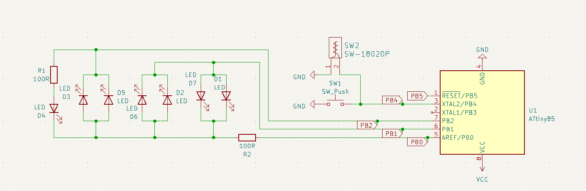
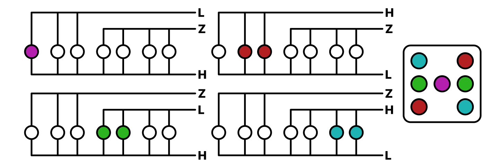
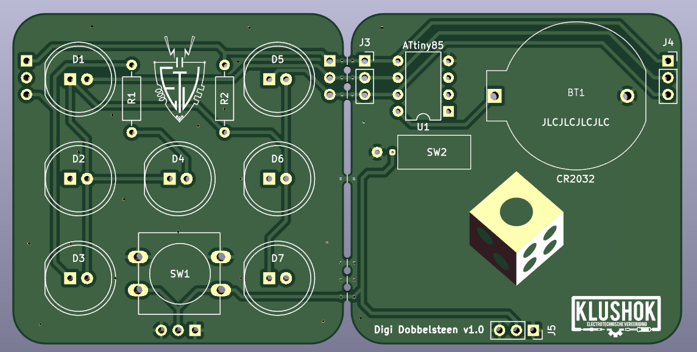

# Digi Dobbelsteen

Digi Dobbelsteen is a digital dice project based on the attiny85 that uses 7 LEDs and a push button.

## Features

- 7 LEDs to display the result of the dice roll
- A push button to roll the dice
- A vibration sensor to roll the dice when the device is shaken

## Usage

The code was written in PlatformIO, so you can use that to compile and upload the code to the attiny85.

The schematic was made in KiCad 7.0, so you can use that to open the schematic and PCB files.

## Schematic

## Charlieplexing

## PCB

